**== Задание ==**
# Part 1 Запуск нескольких docker-контейнеров с использованием docker compose

1) Написать Dockerfile для каждого отдельного микросервиса. Необходимые зависимости описаны в материалах. В отчете отобразить размер собранных образов любого сервиса различными способами.

### Пример Dockerfile

```yaml
# Stage 1: Сборка приложения
FROM maven:3.8.4-jdk-8 AS build
# Устанавливаем рабочую директорию
WORKDIR /app
# Копируем файлы сборки
COPY .mvn .mvn
COPY mvnw pom.xml ./
RUN mvn -B dependency:go-offline
# Копируем исходный код
COPY src ./src
# Собираем приложение
RUN mvn -B package -DskipTests
# Stage 2: Запуск приложения в отдельном контейнере
FROM openjdk:8-jdk-alpine
# Копируем собранное приложение из предыдущего стейджа
COPY --from=build /app/target/*.jar /app/app.jar
# Ожидаем, пока база данных PostgreSQL будет доступна
RUN apk add --no-cache bash
COPY wait-for-it.sh .
RUN chmod +x wait-for-it.sh
# Открываем порт для внешнего доступа
EXPOSE 8083
# Запускаем приложение
CMD ["./wait-for-it.sh", "postgres:5432", "--", "java", "-jar", "/app/app.jar"]
```
### Размеры образов
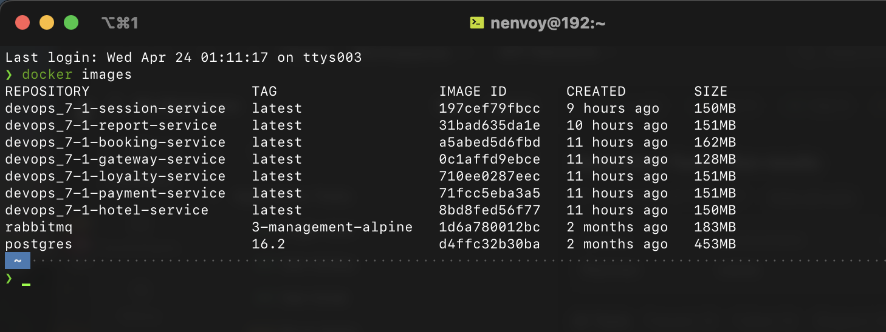

2) Написать docker-compose файл, который осуществляет корректное взаимодействие сервисов. Пробросить порты для доступа к gateway service и session service из локальной машины. Помощь по docker compose в материалах.

### Docker-compose +  .env

Кроме очевидного docker-compose в проекте был так же использован .env файл в котором хранятся все переменные которые требуются приложения. Это хорошая практика в тех ситуациях когда вам не нужно что бы такая информация как секреты и пароли была у всех на виду. Прокидываеться файл в docker-compose вот таким образом ```env_file: .env```

```yaml
version: '3.8'

x-common-variables: &common-variables
  env_file: .env
  networks:
    - backend

services:
  # PostgreSQL service
  postgres:
    image: postgres:16.2
    restart: always
    <<: *common-variables
    ports:
      - "5432:5432"
    volumes:
      - ./src/services/database/init.sql:/docker-entrypoint-initdb.d/init.sql
      - postgres:/var/lib/postgres/data

  # RabbitMQ service
  rabbitmq:
    image: rabbitmq:3-management-alpine
    <<: *common-variables
    ports:
      - "5672:5672"
      - "15672:15672"

  # Session service
  session-service:
    build: ./src/services/session-service
    <<: *common-variables
    ports:
      - "8081:8081"
    environment:
      POSTGRES_DB: users_db
    depends_on:
      - postgres


  # Hotel service
  hotel-service:
    build: ./src/services/hotel-service
    <<: *common-variables
    ports:
      - "8082:8082"
    environment:
      POSTGRES_DB: hotels_db
    depends_on:
      - postgres

  # Bookingment service
  booking-service:
    build: ./src/services/booking-service
    <<: *common-variables
    ports:
      - "8083:8083"
    environment:
      POSTGRES_DB: reservations_db
    depends_on:
      - postgres
      - rabbitmq

  # Payment service
  payment-service:
    build: ./src/services/payment-service
    <<: *common-variables
    ports:
      - "8084:8084"
    environment:
      POSTGRES_DB: payments_db
    depends_on:
      - postgres

  # Loyalty service
  loyalty-service:
    build: ./src/services/loyalty-service
    <<: *common-variables
    ports:
      - "8085:8085"
    environment:
      POSTGRES_DB: balances_db
    depends_on:
      - postgres

  # Report service
  report-service:
    build: ./src/services/report-service
    <<: *common-variables
    ports:
      - "8086:8086"
    environment:
      POSTGRES_DB: statistics_db
    depends_on:
      - postgres
      - rabbitmq

  # Gateway service
  gateway-service:
    build: ./src/services/gateway-service
    <<: *common-variables
    ports:
      - "8087:8087"
    depends_on:
      - postgres

networks:
  backend:

volumes:
  postgres:
```

```bash
POSTGRES_PORT=5432
POSTGRES_USER=postgres
POSTGRES_PASSWORD=postgres
POSTGRES_HOST=postgres
POSTGRES_DB=postgres
RABBIT_MQ_HOST=rabbitmq
RABBIT_MQ_PORT=5672
RABBIT_MQ_USER=guest
RABBIT_MQ_PASSWORD=guest
RABBIT_MQ_QUEUE_NAME=messagequeue
RABBIT_MQ_EXCHANGE=messagequeue-exchange
HOTEL_SERVICE_PORT=8082
HOTEL_SERVICE_HOST=hotel-service
PAYMENT_SERVICE_PORT=8084
PAYMENT_SERVICE_HOST=payment-service
LOYALTY_SERVICE_PORT=8085
LOYALTY_SERVICE_HOST=loyalty-service
SESSION_SERVICE_PORT=8081
SESSION_SERVICE_HOST=session-service
BOOKING_SERVICE_PORT=8083
BOOKING_SERVICE_HOST=booking-service
PAYMENT_SERVICE_PORT=8084
PAYMENT_SERVICE_HOST=payment-service
REPORT_SERVICE_PORT=8086
REPORT_SERVICE_HOST=report-service
```
3) Собрать и развернуть веб-сервис с помощью написанного docker compose файла на локальной машине.

Запуск и сборка осуществляеться командой **docker-compose up**, флаг **-d** позволяет сделать запуск в фоне не занимая ваш терминал в последствии. Для сборки заново можно использовать **docker-compose build**. Для остановки **docker-compose down**.

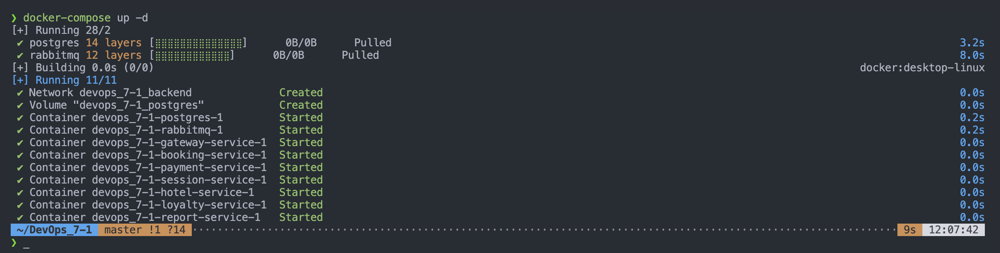

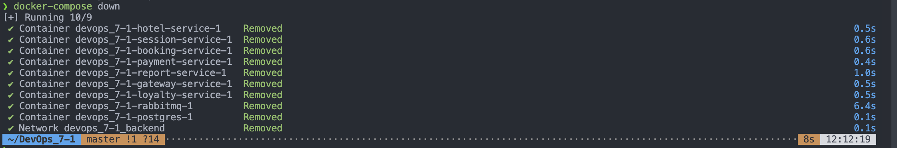

4) Прогнать заготовленные тесты через postman и удостовериться, что все они проходят успешно. Инструкцию по запуску тестов можно найти в материалах. В отчете отобразить результаты тестирования.

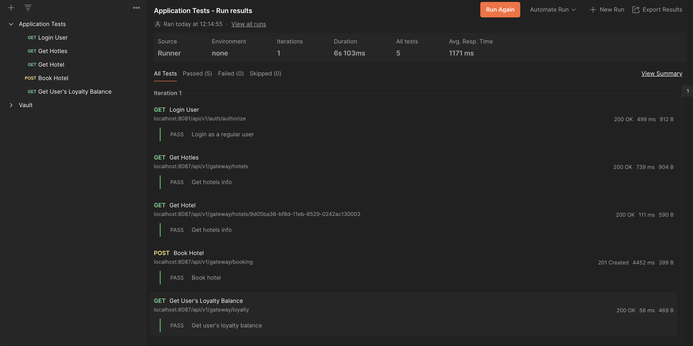


# Part 2. Создание виртуальных машин

1) Установить и инициализировать Vagrant в корне проекта. Написать Vagrantfile для одной виртуальной машины. Перенести в виртуальную машину исходный код веб-сервиса в рабочую директорию виртуальной машины. Помощь по vagrant в материалах.

Vagrantfile - мой случай не много специфический так как выполнялся проект на Mac M1, на котором не просто все с виртуализацией. Для ознаколмения вот ссылочка на статью которая мне помогла. [Хабр - Запускаем Vagrant на MacOS Apple M1/M2](https://habr.com/ru/companies/bar/articles/708950/comments/)

```yaml
# -*- mode: ruby -*-
# vi: set ft=ruby :

Vagrant.configure("2") do |config|
  config.vm.box = "spox/ubuntu-arm"
  config.vm.box_version = "1.0.0"
  config.vm.synced_folder ".", "/vagrant_data", create: true
  config.vm.provider :vmware_desktop do |vmware|
    vmware.gui = true
    vmware.cpus = 2
    vmware.vmx["ethernet0.virtualdev"] = "vmxnet3"
    vmware.ssh_info_public = true
    vmware.linked_clone = false
  end
end
```

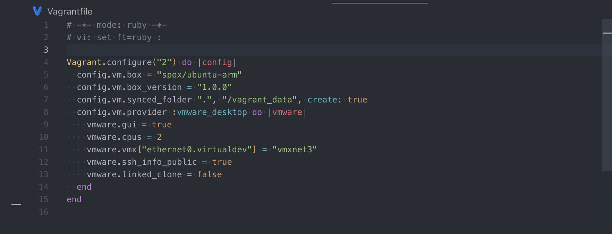

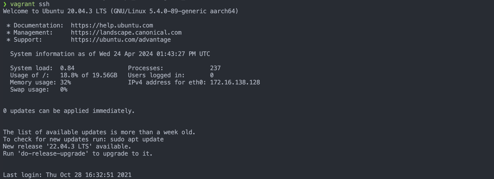

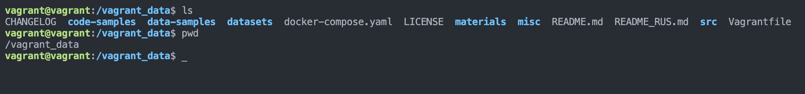

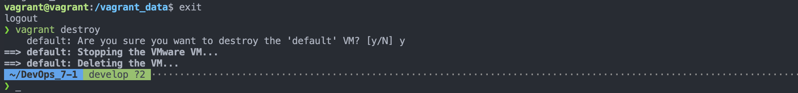

# Part 3. Создание простейшего docker swarm

1) Модифицировать Vagrantfile для создания трех машин: manager01, worker01, worker02. Написать shell-скрипты для установки docker внутрь машин, инициализации и подключения к docker swarm. Помощь с docker swarm материалах.

Пример обновленого Vagrantfile c с сылками на скрипты. Скрипты находятся в корне проекта.
```yaml
# -*- mode: ruby -*-
# vi: set ft=ruby :

Vagrant.configure("2") do |config|
  config.vm.box = "spox/ubuntu-arm"
  config.vm.box_version = "1.0.0"
  config.vm.synced_folder ".", "/vagrant_data", create: true
  config.vm.define "manager01" do |manager|
    # nginx's ports
    manager.vm.network :forwarded_port, guest: 8081, host: 8081
    manager.vm.network :forwarded_port, guest: 8087, host: 8087
    # portainer's ports
    manager.vm.network :forwarded_port, guest: 9000, host: 9000
    manager.vm.network :forwarded_port, guest: 8000, host: 8000
    manager.vm.network :forwarded_port, guest: 9443, host: 9443
    manager.vm.provider :vmware_desktop do |vmware|
      vmware.gui = true
      vmware.cpus = 2
      vmware.vmx["ethernet0.virtualdev"] = "vmxnet3"
      vmware.ssh_info_public = true
      vmware.linked_clone = false
    end
    manager.vm.hostname = "manager01"
    manager.vm.provision "shell", inline: <<-SHELL
      sudo bash /vagrant_data/install_docker.sh
      sudo bash /vagrant_data/init_swarm.sh > /vagrant_data/join_swarm.txt
    SHELL
  end

  config.vm.define "worker01" do |worker1|
    worker1.vm.provider :vmware_desktop do |vmware|
      vmware.gui = true
      vmware.cpus = 2
      vmware.vmx["ethernet0.virtualdev"] = "vmxnet3"
      vmware.ssh_info_public = true
      vmware.linked_clone = false
    end
    worker1.vm.hostname = "worker01"
    worker1.vm.provision "shell", inline: <<-SHELL
      sudo bash /vagrant_data/install_docker.sh
      sudo bash /vagrant_data/init_swarm.sh
    SHELL
  end

  config.vm.define "worker02" do |worker2|
    worker2.vm.provider :vmware_desktop do |vmware|
      vmware.gui = true
      vmware.cpus = 2
      vmware.vmx["ethernet0.virtualdev"] = "vmxnet3"
      vmware.ssh_info_public = true
      vmware.linked_clone = false
    end
    worker2.vm.hostname = "worker02"
    worker2.vm.provision "shell", inline: <<-SHELL
      sudo bash /vagrant_data/install_docker.sh
      sudo bash /vagrant_data/init_swarm.sh
    SHELL
  end
end

```

2) Загрузить собранные образы на docker hub и модифицировать docker-compose файл для подгрузки расположенных на docker hub образов.

Для загрузки образов требуется сделать docker login, проставить тэги вашим образам и отправить их в хранилище. В docker-compose соответвенно была заменена строчка **build** на **image: nenvoy42/devops_7-1-payment-service:1.0.2**
```bash
docker login
docker tag existing-image-name username/new-image-name:tag
docker push username/new-image-name:tag
```
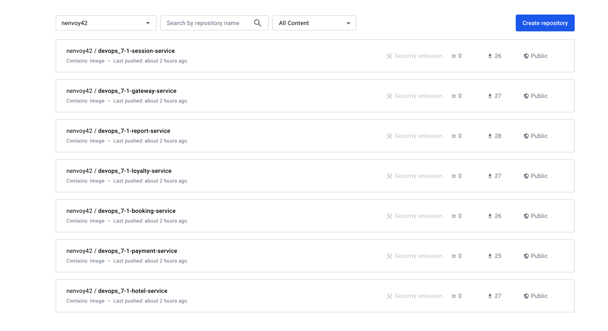

3) Поднять виртуальные машины и перенести на менеджер docker-compose файл. Запустить стек сервисов, используя написанный docker-compose файл.
4) Настроить прокси на базе nginx для доступа к gateway service и session service по оверлейной сети. Сами gateway service и session service сделать недоступными напрямую.
5) Прогнать заготовленные тесты через postman и удостовериться, что все они проходят успешно. В отчете отобразить результаты тестирования.
6) Используя команды docker, отобразить в отчете распределение контейнеров по узлам.

Я объеденю эти задание в одно, так как описывать каждый шаг довольно скучно. Для выполнения 4 пункта я отредактировал docker-compose.yml и удалил секции ports. Это предотвратит прямой доступ к ним с хост-машины. Прокинул сеть для всех сервисов и добавил файл конфигурации nginx который можно посмотреть в корне проекта. Ниже скриншоты по всем 4 пунктам

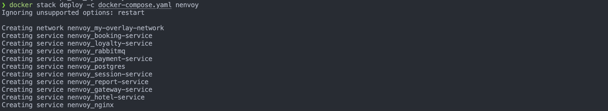
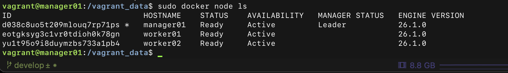
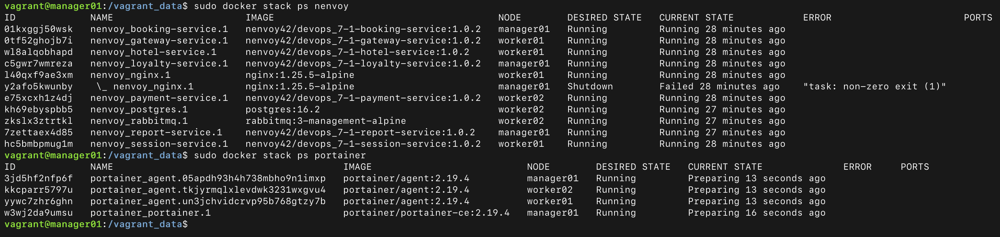
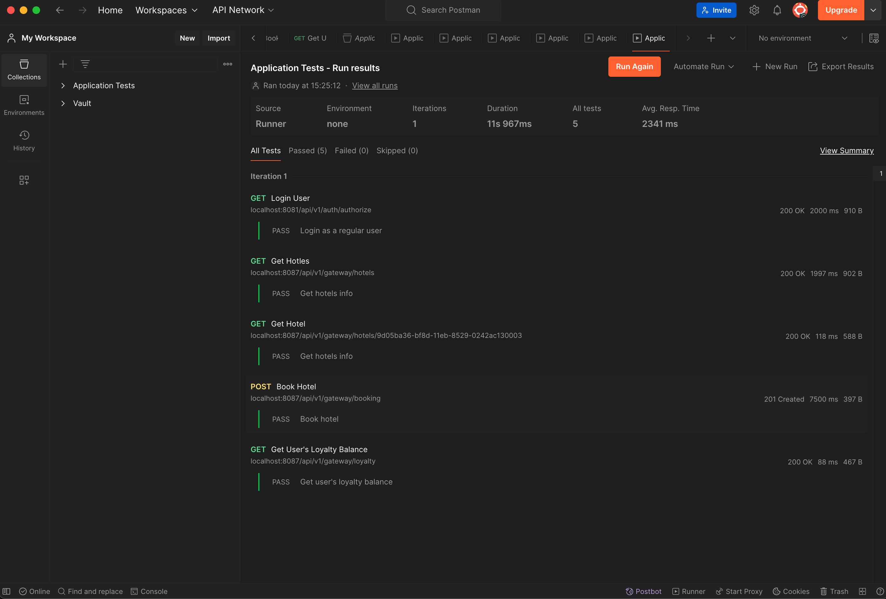

7) Установить отдельным стеком Portainer внутри кластера. В отчете отобразить визуализацию распределения задач по узлам с помощью Portainer.

Для этого на машнине manager01 был запущен еще одни docker-compose для установки Portainer. Все файлы есть в проекте.

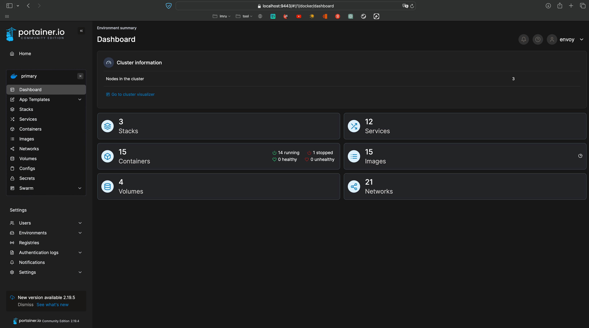
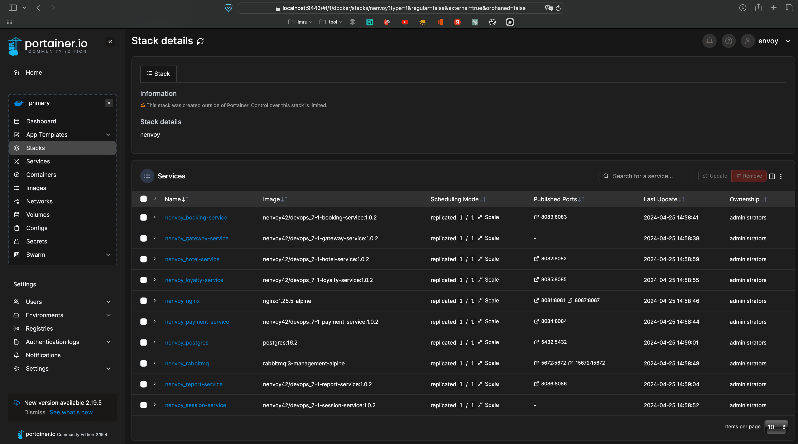
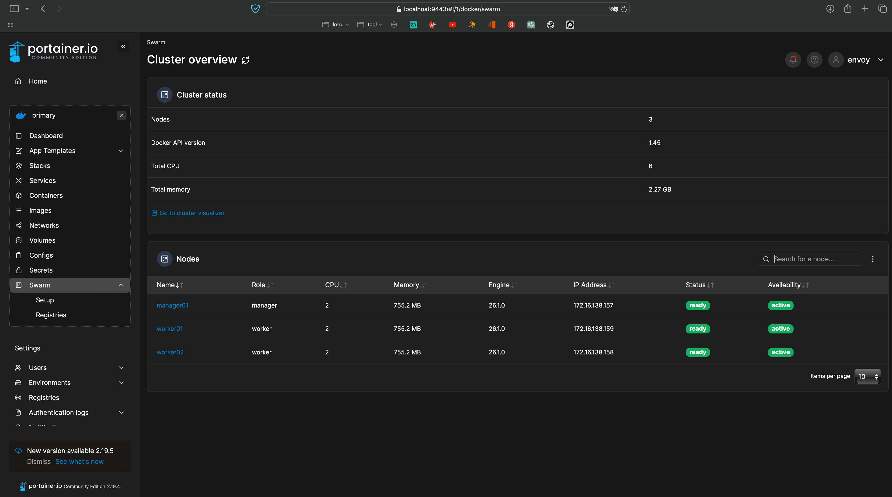
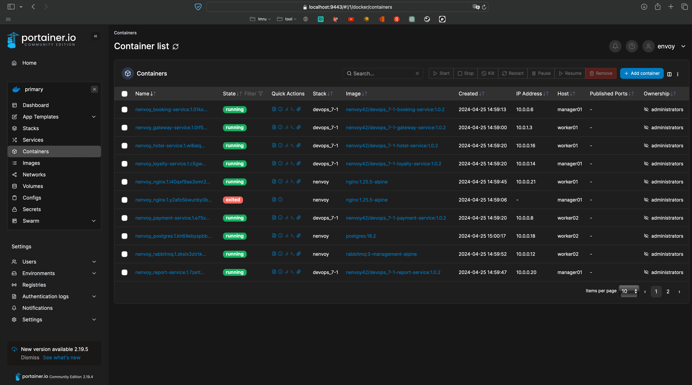
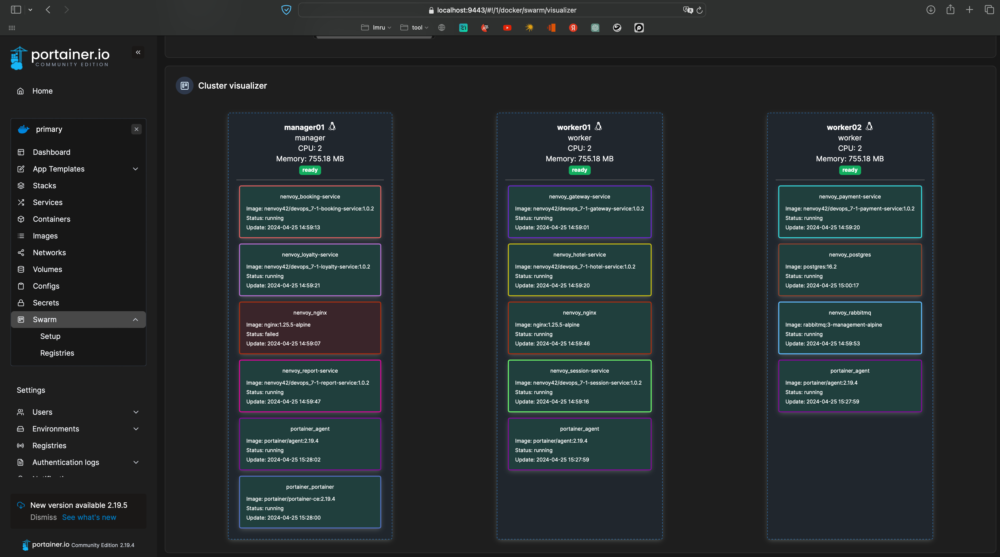


**Cпасибо за внимание!**
